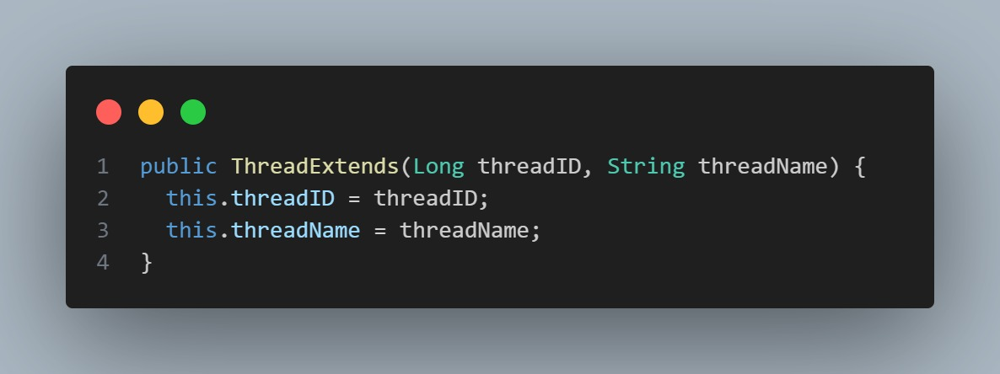

## Threads Nedir?
Threads, bir programın aynı anda birden fazla iş yapmasını sağlayan parçalarıdır. 
Düşün ki bilgisayarın bir fabrikadır ve her thread fabrikadaki bir işçidir. 
Bu işçiler aynı anda farklı işler yapabilirler, bu da işleri hızlandırır.

### Neden Threads Kullanılır?
1. Çoklu Görev (Multitasking): Bir program aynı anda birden fazla işi yapabilir. Örneğin, müzik dinlerken aynı anda internetten dosya indirebilirsiniz.
2. Performans Artışı: Büyük işleri daha küçük parçalara ayırarak aynı anda yürütebiliriz, böylece işler daha hızlı biter.
3. Kullanıcı Deneyimi: Kullanıcı arayüzü yanıt vermeyi sürdürürken arka planda işler yapabiliriz. Örneğin, bir oyun oynarken oyun yüklenirken arka planda seslerin yüklenmesi gibi.

### Java'da Threads Kullanımı
Java'da thread kullanmanın iki ana yolu vardır:
1. Thread Sınıfını Genişletmek (Extend): Kendi sınıfınızı Thread sınıfından türetirsiniz ve run metodunu geçersiz kılarsınız.
2. Runnable Arayüzünü Kullanmak: Runnable arayüzünü uygulayan bir sınıf oluşturur ve run metodunu tanımlarsınız.

## Örnek Anlatım: Thread Sınıfını Genişletmek
Bir fabrikanın farklı departmanlarında çalışan işçiler düşünelim: biri meyve paketliyor, biri yazılım kodluyor, diğeri de tarayıcıda geziniyor. 
Her bir işçi kendi işi üzerinde çalışıyor ve bu işçiler thread olarak temsil edilebilir.

### Sınıf Tanımlama ve Değişkenler:

- `ThreadExtends` adında bir sınıf tanımlıyoruz ve `Thread` sınıfından genişletiyoruz.
- Her thread için bir kimlik `threadID` ve isim `threadName` tutuyoruz.

### Yapıcı Metodlar:

Thread oluştururken kimlik ve isim belirleyebiliyoruz.

### Run Metodu:

- `run` metodu, thread'in yapacağı işi tanımlar.
- Burada, thread 1'den 9'a kadar sayar ve her sayıda bir saniye bekler `Thread.sleep(1000)`

### Thread'leri Başlatma:

- Üç farklı thread oluşturup başlatıyoruz.
- `t1.start()` ile `t1` thread'ini başlatıyoruz ve `t1.join()` ile `t1` bitene kadar bekliyoruz.
- Sonra `t2` ve `t3` thread'lerini başlatıyoruz.

## Özet
- Thread: Bir programın aynı anda birden fazla işi yapmasını sağlayan yapı.
- Neden Kullanılır: Performansı artırmak, çoklu görev yürütmek ve kullanıcı deneyimini iyileştirmek için.
- Java'da Kullanımı: `Thread` sınıfını genişletmek veya `Runnable` arayüzünü uygulamak.
